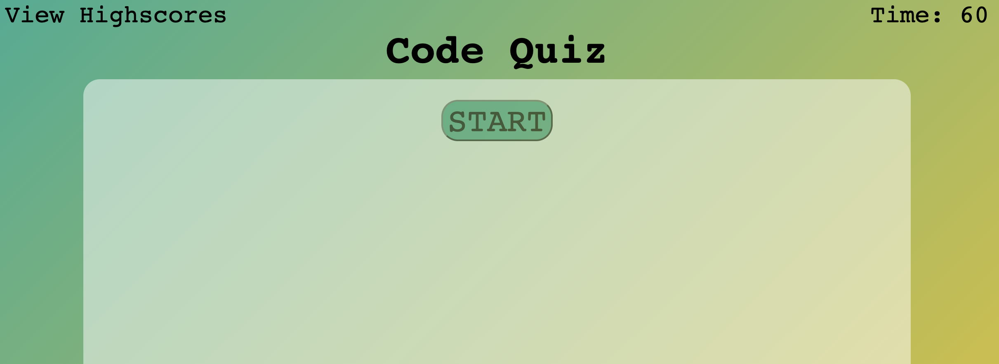
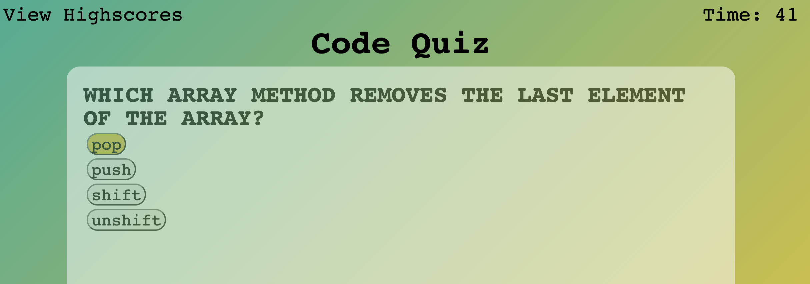
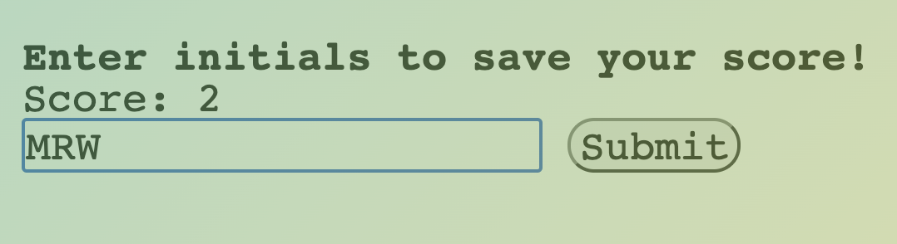
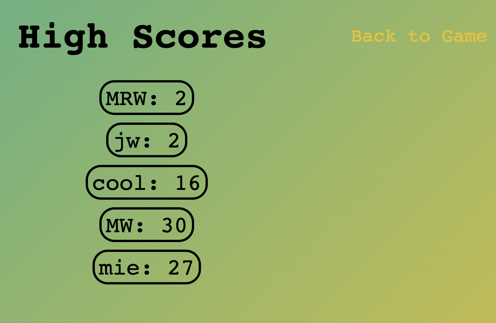

# Code Quiz

## Mitchel Wachtel - mitchel.wachtel@gmail.com

---
### Table of contents
* [Technology](#technology)
* [Description](#description)
* [Links](#links)
* [Installation](#installation)
* [Credits](#credits)
* [License](#license)
* [Contact](#contact)
---

## Technology

Technologies used: Javascript with HTML & CSS. GitHub pages was used in order to publish the site.

---

## Description

This web project displays a question and begins a countdown timer when the Start button is clicked. When an answer is selected, the js script decides if the answer is correct or not, displays "correct" or "incorrect", provides another question, and then subtracts 10 from the timer IF the answer was incorrect. After all 5 questions OR if the timer hits 0, the user has the ability to input their initials and their score is displayed (along with other localStorage key-value pairs) on the highscores.html page.

### Motivation

My motivation for this project was to try out multiple techniques and solve several problems that I did not initially feel comfortable with. The first was setting up an object. I used this to organize the questions and their answers. I got to practice setting up timers/intervals, eventListeners, .hidden, and localStorage. Adding elements to the DOM and using js to "animate" were also big steps that I was excited to get pracitice with.

### Biggest Takeaways

I continue to learn more about the importance of scope and how my code reacts to variables and functions that are available at different levels of scope. This is certainly a topic that felt very simple on the surface, but I grow with appreciation on the topic with each project. I learned how to use and access local storage and use it on a separate HTML as it pertained to this job. I also learned how to use setInterval to do more than just count-up or count-down, and I believe this is going to be very valuable moving forward.

### Struggles

The single greatest difficulty on this project was figuring out how to access the localStorage and pull this information up on highscores.html. Since this was essential to the project, I was hung up on this for a while. The other very difficult task for me was figuring out how to animate the "correct" and "incorrect" text as it appears and disappears.

### Next Steps

Create a bank of x questions and have the program randomly give out 5 of them. This would create more of a unique experience and would be a better practice tool for those looking to study coding facts.

---

## Links

### **Deployed Site** can be found _[here](https://www.mitchelwachtel.me/code-quiz/)_.

### **GitHub Repository** can be found _[here](https://github.com/mitchelwachtel/code-quiz)_.

---

## Installation

Simply open in a brower and the webpage should appear as below.

---

## Credits

Since this was such an involved project, I took inspiration from a few sources. _[This thread](https://stackoverflow.com/questions/6121203/how-to-do-fade-in-and-fade-out-with-javascript-and-css)_ on Stack Overflow really helped me use setInterval for something besides a countdown timer. One of my biggest struggles was retrieving the data from local storage in a way that is acessible to me on the highscores.html page. _[This thread](https://stackoverflow.com/questions/17745292/how-to-retrieve-all-localstorage-items-without-knowing-the-keys-in-advance)_ on Stack Overflow was very helpful. This thread did not answer all of my questions, but it gave me enough foundation to where I could use my own knowledge to connect the dots to apply it to this particular situation.

---

## License

GNU General Public License v3.0

---
## Contact

If you have any questions, please send me an email at mitchel.wachtel@gmail.com and you can visit my GitHub at https://github.com/mitchelwachtel